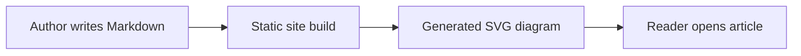

This article demonstrates a diagram written directly in Markdown. The build
creates a local SVG, so the published page has no diagram-rendering JavaScript.

```mermaid
flowchart LR
  Author[Author writes Markdown] --> Build[Static site build]
  Build --> SVG[Generated SVG diagram]
  SVG --> Reader[Reader opens article]
```
