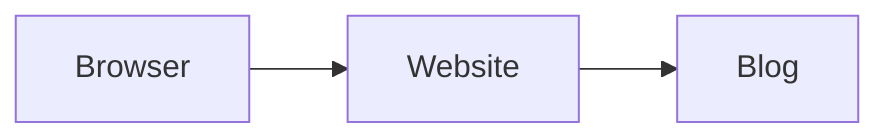

# Blog authoring

Place one Markdown file per article in `content/blog/`. Its filename becomes
the article URL: `my-article.md` becomes `/blog/my-article/`.

Every article requires this frontmatter:

```md
---
title: A clear article title
publishedAt: 2026-09-02
description: A short summary shown in the post menu, limited to two lines.
---

Your article content in Markdown starts here.
```

Posts are ordered by `publishedAt`, newest first. Add `draft: true` to keep an
article out of the public post list and generated site.

## Images and attachments

Folders are supported. Keep an article's images or other linked files anywhere
inside `content/blog/` and link them normally from Markdown, relative to the
article file:

```md

[Download the source](./my-article/example.zip)
```

On build, every non-Markdown file is copied to `/blog-assets/` with the same
folder structure. Local Markdown links are automatically rewritten to that
public path.

## Mermaid diagrams

Use a fenced `mermaid` block directly in an article. The build turns it into a
local SVG, so readers do not need JavaScript to see it.

````md

````
